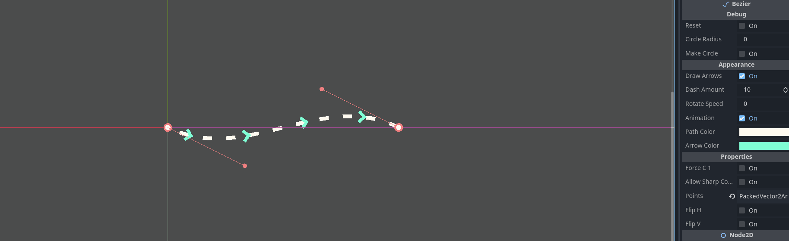
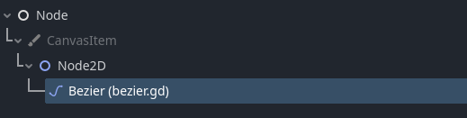
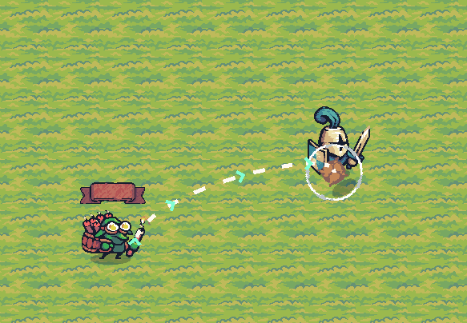

# Godot Bezier Plugin
[](https://choosealicense.com/licenses/mit/)

An editor plugin to create and manipulate bezier cubic curves in Godot.



## Controls
- `Shift` + `Left click`: add point at mouse position.
- `Ctrl` + `Left click`: remove mouse under cursor.

## API Reference
|Variable             |Type                   |Description                                                                    |
|`points`             |`PackedVector2Array`   |Points that form the curve (curve points + control points)                     |
|`flip_h`             |`bool`                 |When set to true, points will be flipped horizontally                          |
|`flip_v`             |`bool`                 |When set to true, points will be flipped horizontally                          |
|`force_c1`           |`bool`                 |If enabled, control points adjust automatically to ensure $C^1$ continuity     |
|`allow_sharp_corners`|`bool`                 |If enabled, control points are not forced to stay aligned                      |
|`reset`              |`bool`                 |When set to `true`, sets the curve to its initial state                        |
|`draw_arrows`        |`bool`                 |Whether arrows should be drawn over the curve                                  |
|`dash_amount`        |`int`                  |Number of divisions on each segment. If set to `0`, the curve will be filled   |
|`rotate_speed`       |`float`                |Speed rotation animation                                                       |
|`animation`          |`bool`                 |Whether animations should take effect                                          |
|`pathColor`          |`Color`                |Color of the curve main path                                                   |
|`arrowColor`         |`Color`                |Color of the arrows                                                            |
|`draw_width`         |`float`                |Width of subdivisions                                                          |

|Method                       |Parameter                                                                |Returns                              |Description                                                                      |
|:---                         |:--------                                                                |:-------                             |:-------------------------                                                       |
|`add_point`                  |`position: Vector3`                                                      |`void`                               |Add a new point to the spline at `position` and control points                   |
|`move_point`                 |`idx: int`, `position: Vector2`                                          |`void`                               |Move the point at index `idx` to `position`                                      |
|`get_point`                  |`idx: int`                                                               |`void`                               |                                                                                 |
|`delete_point`               |`idx: int`                                                               |`bool`: could delete point           |Remove a curve point at index `idx` position and its control points              |
|`set_points`                 |`points: PackedVector2Array`                                             |`void`                               |                                                                                 |
|`set_points_circle`          |`radius: float`                                                          |`void`                               | Arrange the points to form a circunference of the specified `radius`                                                                                  |
|`move_node_along_path`       |`node: Node2D`<br/> `time: float`<br/> `on_finish_action: Callable = func() : return`<br/> `align_rot: bool = false`| `void`                               | `node` will tarverse the curve in the specified `time` while being aligned with it if `align_rot = true`. When finished, `on_finish_action` will be called|
|                             |                                                                         |                                     |                                                                                      |
|`eval`                       |`t: float`                                                               |`Vector2`                            |Evaluates the spline for $t\in [0,1]$                                                 |
|`eval_deriv`                 |`t: float`                                                               |`Vector2`                            |Evaluates the spline derivative for $t\in [0,1]                                       |
|`cubic_bezier`               |`p0: Vector2`, `p1: Vector2`, `p2: Vector2`, `p3: Vector2`, `t: float`   |`Vector2`                            |Evaluates a cubic bezier defined by `p0`,`p1`,`p2`,`p3` for $t\in [0,1]               |
|`n_segments`                 |                                                                         |`int`                                |Number of segments of cubic beziers that build the whole curve.                       |
|`eval_segment`               |`segment_idx: int`,`t: float`                                            |`Vector2`                            |Evaluates an individual segment for $t\in [0,1]                                       |
|`eval_segment_deriv`         |`segment_idx: int`, `t: float`                                           |`Vector2`                            |Evaluates an individual segment dewrivative for $t\in [0,1]                           |
|`cubic_bezier_deriv`         |`p0: Vector2`, `p1: Vector2`, `p2: Vector2`, `p3: Vector2`, `t: float`   |`Vector2`                            |Evaluates a cubic bezier derivative defined by `p0`,`p1`,`p2`,`p3` for $t\in [0,1]    |
|                             |                                                                         |                                     |                                                                                      |
|`in_curve`                   |`idx: int`                                                               |`bool`                               |Check if point at `idx` is a curve point (not a control point)                        |
|`is_control`                 |`idx: int`                                                               |`bool`                               |Check if point at `idx` is a control point                                            |
|`get_opposite_control`       |`idx: int`                                                               |`int`: `-1` if not valid point found |Given a control point index, return the index of the one that shares curve point      |
|`get_affected_curve_point`   |`idx: int`                                                               |`int`                                |Given a control point index, return the index of the curve point that it affects      |
|`make_controls_equidistant`  |                                                                         |`void`                               | Arrange pairs of control points to ensure $C^1$ continuity  arrang                   |
|`make_controls_aligned`      |                                                                         |`void`                               |Arrange pairs of control points to avoid sharp corners continuity                     |
|`draw_segment`               |`segment_idx: int`                                                       |`void`                               |Draws an individual segment on screen                                                 |
|`draw_arrow`                 |`t: float`                                                               |`void`                               |Draws an arrow over the curve at $t\in [0,1]$ moves                                   |


## Installation

1. Copy the addons folder to the root of your project.
2. Build the project.
3. Go to `Project -> Project Settings -> Plugins` to enable the plugin.
4. Now you can add the bezier node within Godot UI.

    

> [!TIP]
> If you don't need the node to appear as a new node type, you can just add the script `bezier.gd` to any node.
    
## Usage/Examples

### C#



```cs
[Export] Nvode2D path;

private void ShootTNT(){
  if (Velocity.X != 0)
    path.Set("flip_h", spriteNode.FlipH);

  Vector2 spawnPos = (Vector2)path.Call("eval", 0.0f);
  Enemy target = visionCone.GetNodeInside<Enemy>();
  Vector2 targetPos = IsInstanceValid(target) ? target.GlobalPosition : GlobalPosition + RandomVector(50);
  Projectile p = tntPrefab.Instantiate<Projectile>();
  GetTree().CurrentScene.AddChild(p);
  p.GlobalPosition = GlobalPosition + spawnPos;
  p.rotateSpeed = (float)GD.RandRange(7.0, 15.0);

  Vector2 last_ctrl_point = (Vector2)path.Call("get_point", 2);
  last_ctrl_point.X = Mathf.Abs(last_ctrl_point.X) * (targetPos.X < GlobalPosition.X ? -1 : 1);
  last_ctrl_point.Y = Mathf.Abs(last_ctrl_point.Y) * (targetPos.Y < GlobalPosition.Y ? -1 : 1);

  Action stop_rotating = () => {
      p.Explode();
  };

  path.Call("move_point", 3, targetPos - GlobalPosition);
  path.Call("move_node_along_path", p, 1.0, Callable.From(stop_rotating));
}
```
